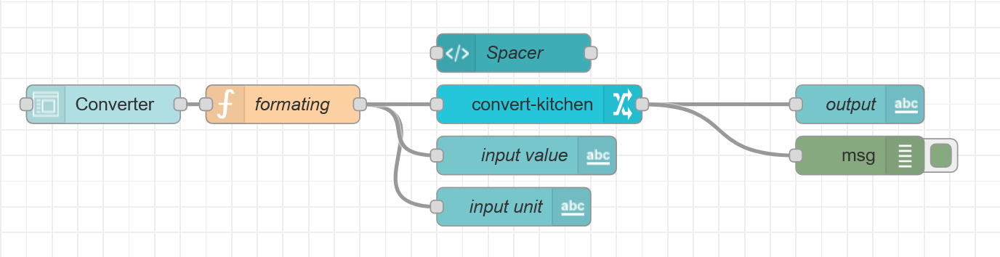
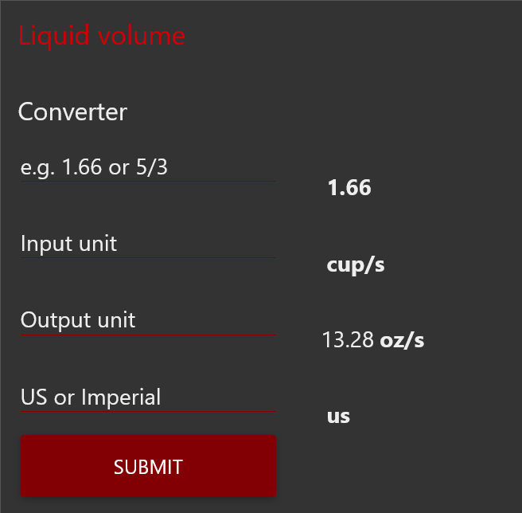

[](https://nodered.org)
[](https://www.npmjs.com/package/node-red-contrib-convert-kitchen)
[](https://www.npmjs.com/package/node-red-contrib-convert-kitchen)
[](https://github.com/HaroldPetersInskipp/node-red-contrib-convert-kitchen/blob/main/LICENSE)

## node-red-contrib-convert-kitchen
A simple Node-RED node to convert between units of measurement for cooking.


### Quick Start
Install with the built in <b>Node-RED Palette manager</b> or using npm:
```
npm install node-red-contrib-convert-kitchen
```

### Example
[](https://github.com/HaroldPetersInskipp/node-red-contrib-convert-kitchen/blob/main/examples/convert-kitchen.json)
This example can be imported from within Node-RED with:
IMPORT > EXAMPLES > node-red-contrib-convert-kitchen
[](https://github.com/HaroldPetersInskipp/node-red-contrib-convert-kitchen/blob/main/examples/convert-kitchen.json)

### Help
This documentation is also available in the help section of the node.

This node expects the following three inputs:<code>msg.value</code><code>msg.unit</code><code>msg.finalUnit</code>

<code>msg.value</code> must be a number.
Both <code>msg.unit</code> and <code>msg.finalUnit</code> must be strings, the following US units are supported:
<b>gallon</b>, <b>liter</b>, <b>quart</b>, <b>pint</b>, <b>cup</b>, <b>ounce</b>, <b>tablespoon</b>, <b>teaspoon</b>, and <b>milliliter</b>.

### Bugs reports and feature requests

Please report any issues or feature requests at <a href="https://github.com/HaroldPetersInskipp/node-red-contrib-convert-kitchen/issues">GitHub</a>.