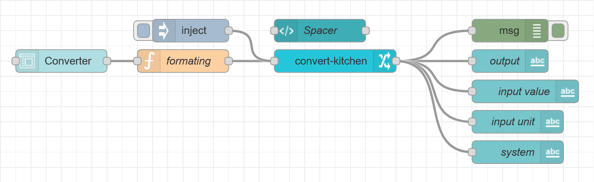

[](https://nodered.org)
[](https://www.npmjs.com/package/node-red-contrib-convert-kitchen)
[](https://www.npmjs.com/package/node-red-contrib-convert-kitchen)
[](https://github.com/HaroldPetersInskipp/node-red-contrib-convert-kitchen/blob/main/LICENSE)

## node-red-contrib-convert-kitchen
A simple Node-RED node to convert between units of measurement for cooking.


### Quick Start
Install with the built in <b>Node-RED Palette manager</b> or using npm:
```
npm install node-red-contrib-convert-kitchen
```

### Example

```
[{"id":"9833aa89b8775756","type":"tab","label":"Converter","disabled":false,"info":""},{"id":"682fccf598700343","type":"debug","z":"9833aa89b8775756","name":"","active":true,"tosidebar":true,"console":false,"tostatus":false,"complete":"true","targetType":"full","statusVal":"","statusType":"auto","x":730,"y":280,"wires":[]},{"id":"1b22265848933a02","type":"ui_text","z":"9833aa89b8775756","group":"dc5caea0185710de","order":8,"width":3,"height":1,"name":"output","label":"{{msg.value}}","format":"{{msg.unit}}/s","layout":"row-left","x":730,"y":240,"wires":[]},{"id":"ca724dfdb0fb5449","type":"ui_form","z":"9833aa89b8775756","name":"","label":"Converter","group":"dc5caea0185710de","order":1,"width":4,"height":1,"options":[{"label":"e.g. 1.66 or 5/3","value":"value","type":"text","required":false,"rows":null},{"label":"Input unit","value":"unit","type":"text","required":false,"rows":null},{"label":"Output unit","value":"finalUnit","type":"text","required":false,"rows":null}],"formValue":{"value":"","unit":"","finalUnit":""},"payload":"","submit":"submit","cancel":"","topic":"topic","topicType":"msg","splitLayout":false,"x":140,"y":240,"wires":[["41c31e3ff8d1e9d1"]]},{"id":"41c31e3ff8d1e9d1","type":"function","z":"9833aa89b8775756","name":"formating","func":"// handle strings and fractions as input, create fallback\nif (msg.payload.value.search(\"/\") !== -1) {\n    msg.payload.value = msg.payload.value.split(\"/\");\n    msg.payload.value = (msg.payload.value[0] / msg.payload.value[1]);\n    msg.payload.value = Math.round(msg.payload.value * 10000) / 10000;\n} else if (msg.payload.value === '') {\n    msg.payload.value = flow.get('value');\n} else {\n    msg.payload.value = parseInt(msg.payload.value);\n    flow.set('value', msg.payload.value);\n};\nif (msg.payload.unit === '') {\n    msg.payload.unit = flow.get('unit');\n} else {\n    flow.set('unit', msg.payload.unit);\n};\nif (msg.payload.finalUnit === '') {\n    msg.payload.finalUnit = flow.get('finalUnit');\n} else {\n    flow.set('finalUnit', msg.payload.finalUnit);\n};\n\nreturn { \"value\": msg.payload.value, \"unit\": msg.payload.unit, \"finalUnit\": msg.payload.finalUnit };","outputs":1,"noerr":0,"initialize":"","finalize":"","libs":[],"x":280,"y":240,"wires":[["87dd3df17627d2ab","f2c1f1d17655f71e","cc1f8c4a7da8a5ce"]]},{"id":"87dd3df17627d2ab","type":"ui_text","z":"9833aa89b8775756","group":"dc5caea0185710de","order":6,"width":3,"height":1,"name":"input unit","label":"","format":"{{msg.unit}}/s","layout":"row-left","x":460,"y":320,"wires":[]},{"id":"f2c1f1d17655f71e","type":"ui_text","z":"9833aa89b8775756","group":"dc5caea0185710de","order":4,"width":3,"height":1,"name":"input value","label":"","format":"{{msg.value}}","layout":"row-left","x":470,"y":280,"wires":[]},{"id":"a4d4b4f0326ad3b9","type":"ui_template","z":"9833aa89b8775756","group":"dc5caea0185710de","name":"Spacer","order":2,"width":3,"height":1,"format":"","storeOutMessages":true,"fwdInMessages":true,"resendOnRefresh":true,"templateScope":"local","x":460,"y":200,"wires":[[]]},{"id":"cc1f8c4a7da8a5ce","type":"convert-kitchen","z":"9833aa89b8775756","name":"","value":0,"unit":"","finalUnit":"","output":"payload","x":480,"y":240,"wires":[["1b22265848933a02","682fccf598700343"]]},{"id":"67950a1982b15e69","type":"ui_spacer","z":"9833aa89b8775756","name":"spacer","group":"dc5caea0185710de","order":3,"width":4,"height":1},{"id":"8e5a8c1a223830eb","type":"ui_spacer","z":"9833aa89b8775756","name":"spacer","group":"dc5caea0185710de","order":5,"width":4,"height":1},{"id":"2e3a0f3377de8b42","type":"ui_spacer","z":"9833aa89b8775756","name":"spacer","group":"dc5caea0185710de","order":7,"width":4,"height":1},{"id":"dc5caea0185710de","type":"ui_group","name":"Liquid volume","tab":"b48aff32d36a85d0","order":1,"disp":true,"width":7,"collapse":false},{"id":"b48aff32d36a85d0","type":"ui_tab","name":"Converter","icon":"dashboard","disabled":false,"hidden":false}]
```

### Help
This documentation is also available in the help section of the node.

This node expects the following three inputs:<code>msg.value</code><code>msg.unit</code><code>msg.finalUnit</code>

<code>msg.value</code> must be a number.
Both <code>msg.unit</code> and <code>msg.finalUnit</code> must be strings, the following units are supported:
<b>gallon</b>, <b>liter</b>, <b>quart</b>, <b>pint</b>, <b>cup</b>, <b>ounce</b>, <b>tablespoon</b>, <b>teaspoon</b>, and <b>milliliter</b>.

### Bugs reports and feature requests

Please report any issues or enhancement requests at <a href="https://github.com/HaroldPetersInskipp/node-red-contrib-convert-kitchen/issues">GitHub</a>.